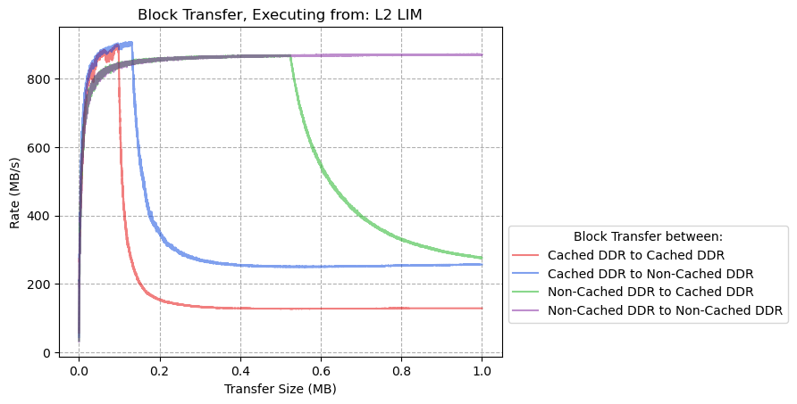
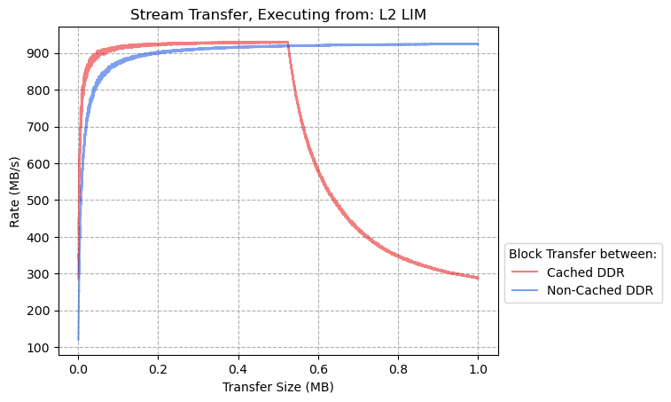
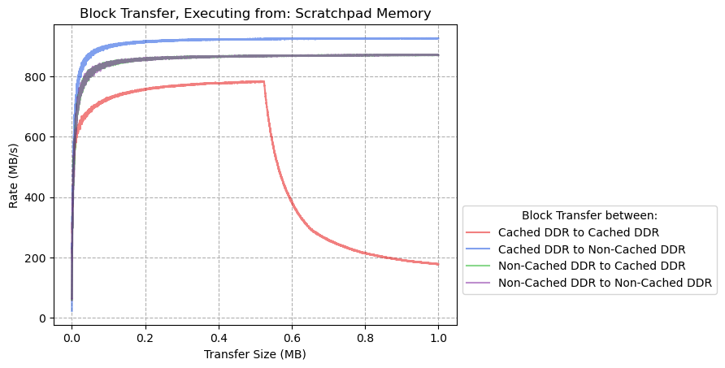
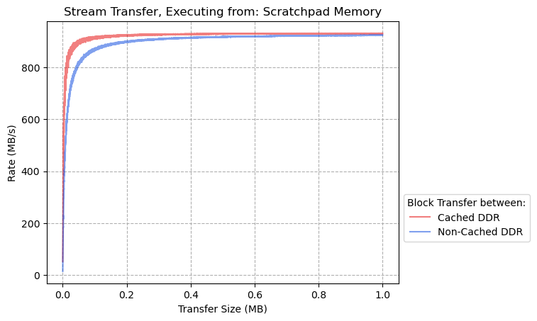
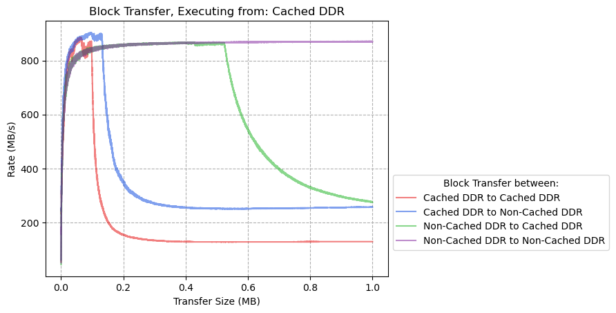
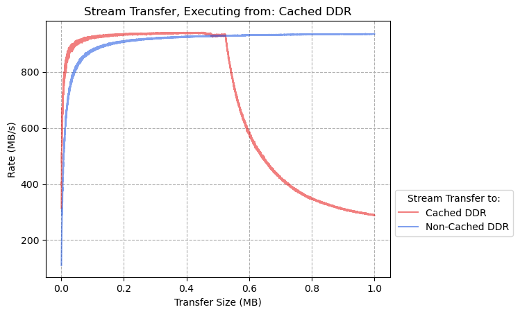

# CoreAXI4 DMA Performance Benchmarks

## 

## Results : Executing  from L2-LIM

### Block Transfer

### Stream Transfer

## Results : Executing from Scratchpad Memory

#### Block Transfer

### Stream Transfer

## Results : Executing from DDR

### Block Transfer

### Stream Transfer

