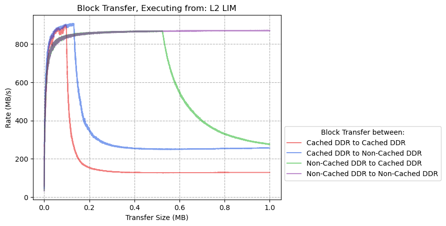
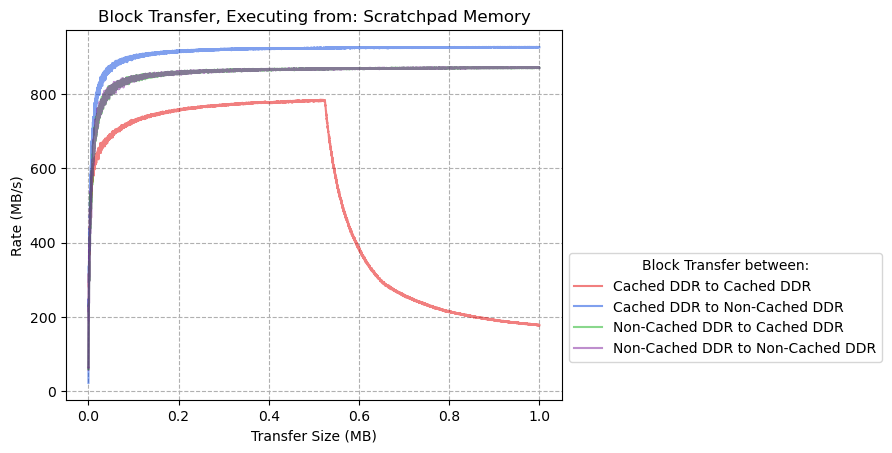
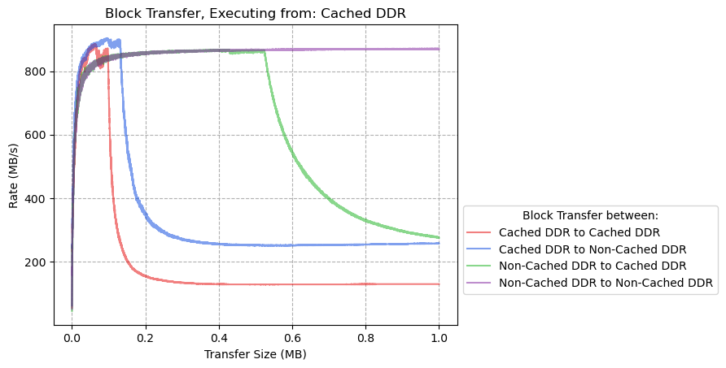
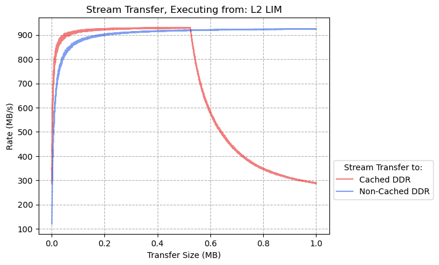
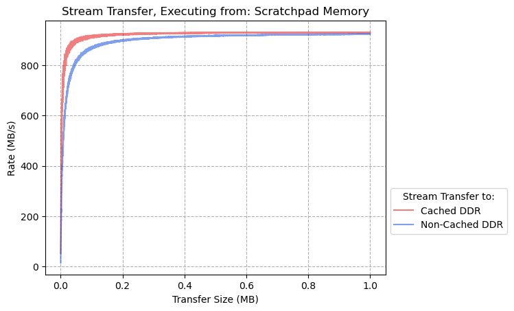
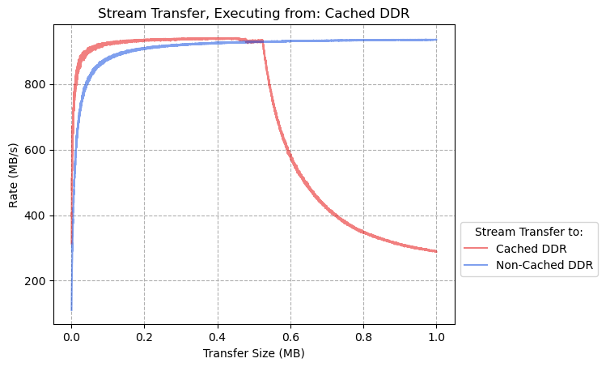

# CoreAXI4 DMA Performance Benchmarks

- [CoreAXI4 DMA Performance Benchmarks](#coreaxi4-dma-performance-benchmarks)
  - [Block Transfers](#block-transfers)
    - [Executing from L2-LIM](#executing-from-l2-lim)
    - [Executing from Scratchpad Memory](#executing-from-scratchpad-memory)
    - [Executing from DDR](#executing-from-ddr)
  - [Stream Transfers](#stream-transfers)
    - [Executing from L2-LIM](#executing-from-l2-lim-1)
    - [Executing from Scratchpad Memory](#executing-from-scratchpad-memory-1)
    - [Executing from DDR](#executing-from-ddr-1)

## Block Transfers

### Executing from L2-LIM

| Source:        | Destination    | Transfer Size (MB) | Peak Rate (MB/s) | % of Theoretical Rate |
| :------------- | :------------- | :----------------- | :--------------- | :-------------------- |
| Cached DDR     | Cached DDR     | 0.10               | 899              | 90%                   |
| Cached DDR     | Non-Cached DDR | 0.12               | 907              | 91%                   |
| Non-Cached DDR | Cached DDR     | 0.52               | 868              | 87%                   |
| Non-Cached DDR | Non-Cached DDR | 1.00               | 871              | 87%                   |

### Executing from Scratchpad Memory

| Source:        | Destination    | Transfer Size (MB) | Peak Rate (MB/s) | % of Theoretical Rate |
| :------------- | :------------- | :----------------- | :--------------- | :-------------------- |
| Cached DDR     | Cached DDR     | 0.52               | 784              | 78%                   |
| Cached DDR     | Non-Cached DDR | 1.00               | 926              | 93%                   |
| Non-Cached DDR | Cached DDR     | 1.00               | 871              | 87%                   |
| Non-Cached DDR | Non-Cached DDR | 1.00               | 871              | 87%                   |

### Executing from DDR

| Source:        | Destination    | Transfer Size (MB) | Peak Rate (MB/s) | % of Theoretical Rate |
| :------------- | :------------- | :----------------- | :--------------- | :-------------------- |
| Cached DDR     | Cached DDR     | 0.06               | 886              | 87%                   |
| Cached DDR     | Non-Cached DDR | 0.01               | 904              | 90%                   |
| Non-Cached DDR | Cached DDR     | 0.43               | 868              | 87%                   |
| Non-Cached DDR | Non-Cached DDR | 1.00               | 871              | 87%                   |

## Stream Transfers

### Executing from: L2-LIM

| Source:          | Destination    | Transfer Size (MB) | Peak Rate (MB/s) | % of Theoretical Rate |
| :--------------- | :------------- | :----------------- | :--------------- | :-------------------- |
| Stream Generator | Cached DDR     | 0.52               | 931              | 93%                   |
| Stream Generator | Non-Cached DDR | 1.00               | 926              | 93%                   |

### Executing from: Scratchpad Memory

| Source:          | Destination    | Transfer Size (MB) | Peak Rate (MB/s) | % of Theoretical Rate |
| :--------------- | :------------- | :----------------- | :--------------- | :-------------------- |
| Stream Generator | Cached DDR     | 1.00               | 932              | 93%                   |
| Stream Generator | Non-Cached DDR | 1.00               | 925              | 93%                   |

### Executing from: DDR

| Source:          | Destination    | Transfer Size (MB) | Peak Rate (MB/s) | % of Theoretical Rate |
| :--------------- | :------------- | :----------------- | :--------------- | :-------------------- |
| Stream Generator | Cached DDR     | 0.46               | 940              | 94%                   |
| Stream Generator | Non-Cached DDR | 1.00               | 936              | 94%                   |
