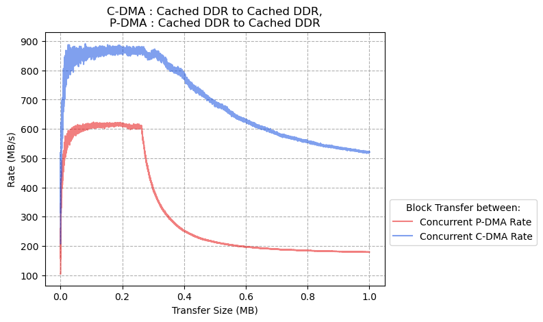
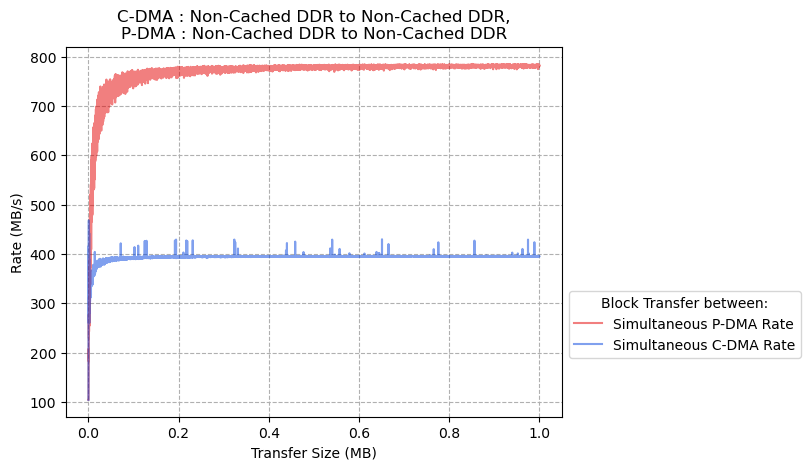

# Concurrent DMA Transfer Benchmarks

## Results

### CoreAXI4 DMA: Cached DDR to Cached DDR, PDMA: Cached DDR to Cached DDR

### CoreAXI4 DMA: Cached DDR to Cached DDR, PDMA: Non-Cached DDR to Cached DDR

### CoreAXI4 DMA: Cached DDR to Cached DDR, PDMA: Non-Cached DDR to Non-Cached DDR

### CoreAXI4 DMA: Cached DDR to Non-Cached DDR, PDMA: Cached DDR to Cached DDR

### CoreAXI4 DMA: Cached DDR to Non-Cached DDR, PDMA: Cached DDR to Non-Cached DDR

### CoreAXI4 DMA: Cached DDR to Non-Cached DDR, PDMA: Non-Cached DDR to Cached DDR

### CoreAXI4 DMA: Non-Cached DDR to Cached DDR, PDMA: Cached DDR to Cached DDR

### CoreAXI4 DMA: Non-Cached DDR to Cached DDR, PDMA: Non-Cached DDR to Cached DDR

### CoreAXI4 DMA: Non-Cached DDR to Non-Cached DDR, PDMA: Cached DDR to Non-Cached DDR

### CoreAXI4 DMA: Non-Cached DDR to Non-Cached DDR, PDMA: Non-Cached DDR to Cached DDR

### CoreAXI4 DMA: Non-Cached DDR to Non-Cached DDR, PDMA: Non-Cached DDR to Non-Cached DDR

