# Concurrent DMA Transfer Benchmarks

- [Concurrent DMA Transfer Benchmarks](#concurrent-dma-transfer-benchmarks)
  - [Results - Block Transfers, Running From Cached DDR](#results---block-transfers-running-from-cached-ddr)
    - [CoreAXI4 DMA: Cached DDR to Cached DDR, PDMA: Cached DDR to Cached DDR](#coreaxi4-dma-cached-ddr-to-cached-ddr-pdma-cached-ddr-to-cached-ddr)
    - [CoreAXI4 DMA: Cached DDR to Cached DDR, PDMA: Cached DDR to Non-Cached DDR](#coreaxi4-dma-cached-ddr-to-cached-ddr-pdma-cached-ddr-to-non-cached-ddr)
    - [CoreAXI4 DMA: Cached DDR to Cached DDR, PDMA: Non-Cached DDR to Cached DDR](#coreaxi4-dma-cached-ddr-to-cached-ddr-pdma-non-cached-ddr-to-cached-ddr)
    - [CoreAXI4 DMA: Cached DDR to Cached DDR, PDMA: Non-Cached DDR to Non-Cached DDR](#coreaxi4-dma-cached-ddr-to-cached-ddr-pdma-non-cached-ddr-to-non-cached-ddr)
    - [CoreAXI4 DMA: Cached DDR to Non-Cached DDR, PDMA: Cached DDR to Cached DDR](#coreaxi4-dma-cached-ddr-to-non-cached-ddr-pdma-cached-ddr-to-cached-ddr)
    - [CoreAXI4 DMA: Cached DDR to Non-Cached DDR, PDMA: Cached DDR to Non-Cached DDR](#coreaxi4-dma-cached-ddr-to-non-cached-ddr-pdma-cached-ddr-to-non-cached-ddr)
    - [CoreAXI4 DMA: Cached DDR to Non-Cached DDR, PDMA: Non-Cached DDR to Cached DDR](#coreaxi4-dma-cached-ddr-to-non-cached-ddr-pdma-non-cached-ddr-to-cached-ddr)
    - [CoreAXI4 DMA: Cached DDR to Non-Cached DDR, PDMA: Non-Cached DDR to Non-Cached DDR](#coreaxi4-dma-cached-ddr-to-non-cached-ddr-pdma-non-cached-ddr-to-non-cached-ddr)
    - [CoreAXI4 DMA: Non-Cached DDR to Cached DDR, PDMA: Cached DDR to Cached DDR](#coreaxi4-dma-non-cached-ddr-to-cached-ddr-pdma-cached-ddr-to-cached-ddr)
    - [CoreAXI4 DMA: Non-Cached DDR to Cached DDR, PDMA: Non-Cached DDR to Cached DDR](#coreaxi4-dma-non-cached-ddr-to-cached-ddr-pdma-non-cached-ddr-to-cached-ddr)
    - [CoreAXI4 DMA: Non-Cached DDR to Cached DDR, PDMA: Cached DDR to Non-Cached DDR](#coreaxi4-dma-non-cached-ddr-to-cached-ddr-pdma-cached-ddr-to-non-cached-ddr)
    - [CoreAXI4 DMA: Non-Cached DDR to Cached DDR, PDMA: Non-Cached DDR to Non-Cached DDR](#coreaxi4-dma-non-cached-ddr-to-cached-ddr-pdma-non-cached-ddr-to-non-cached-ddr)
    - [CoreAXI4 DMA: Non-Cached DDR to Non-Cached DDR, PDMA: Cached DDR to Cached DDR](#coreaxi4-dma-non-cached-ddr-to-non-cached-ddr-pdma-cached-ddr-to-cached-ddr)
    - [CoreAXI4 DMA: Non-Cached DDR to Non-Cached DDR, PDMA: Cached DDR to Non-Cached DDR](#coreaxi4-dma-non-cached-ddr-to-non-cached-ddr-pdma-cached-ddr-to-non-cached-ddr)
    - [CoreAXI4 DMA: Non-Cached DDR to Non-Cached DDR, PDMA: Non-Cached DDR to Cached DDR](#coreaxi4-dma-non-cached-ddr-to-non-cached-ddr-pdma-non-cached-ddr-to-cached-ddr)
    - [CoreAXI4 DMA: Non-Cached DDR to Non-Cached DDR, PDMA: Non-Cached DDR to Non-Cached DDR](#coreaxi4-dma-non-cached-ddr-to-non-cached-ddr-pdma-non-cached-ddr-to-non-cached-ddr)
  - [Results - Stream Transfers, Running from Cached DDR](#results---stream-transfers-running-from-cached-ddr)
    - [CoreAXI4 DMA: Stream Transfer to Cached DDR, PDMA: Cached DDR to Cached DDR](#coreaxi4-dma-stream-transfer-to-cached-ddr-pdma-cached-ddr-to-cached-ddr)
    - [CoreAXI4 DMA: Stream Transfer to Cached DDR, PDMA: Cached DDR to Non-Cached DDR](#coreaxi4-dma-stream-transfer-to-cached-ddr-pdma-cached-ddr-to-non-cached-ddr)
    - [CoreAXI4 DMA: Stream Transfer to Cached DDR, PDMA: Non-Cached DDR to Cached DDR](#coreaxi4-dma-stream-transfer-to-cached-ddr-pdma-non-cached-ddr-to-cached-ddr)
    - [CoreAXI4 DMA: Stream Transfer to Cached DDR, PDMA: Non-Cached DDR to Non-Cached DDR](#coreaxi4-dma-stream-transfer-to-cached-ddr-pdma-non-cached-ddr-to-non-cached-ddr)
    - [CoreAXI4 DMA: Stream Transfer to Non-Cached DDR, PDMA: Cached DDR to Cached DDR](#coreaxi4-dma-stream-transfer-to-non-cached-ddr-pdma-cached-ddr-to-cached-ddr)
    - [CoreAXI4 DMA: Stream Transfer to Non-Cached DDR, PDMA: Cached DDR to Non-Cached DDR](#coreaxi4-dma-stream-transfer-to-non-cached-ddr-pdma-cached-ddr-to-non-cached-ddr)
    - [CoreAXI4 DMA: Stream Transfer to Non-Cached DDR, PDMA: Non-Cached DDR to Cached DDR](#coreaxi4-dma-stream-transfer-to-non-cached-ddr-pdma-non-cached-ddr-to-cached-ddr)
    - [CoreAXI4 DMA: Stream Transfer to Non-Cached DDR, PDMA: Non-Cached DDR to Non-Cached DDR](#coreaxi4-dma-stream-transfer-to-non-cached-ddr-pdma-non-cached-ddr-to-non-cached-ddr)
  - [Results - Block Transfers, Running From Scratchpad Memory](#results---block-transfers-running-from-scratchpad-memory)
    - [CoreAXI4 DMA: Cached DDR to Cached DDR, PDMA: Cached DDR to Cached DDR](#coreaxi4-dma-cached-ddr-to-cached-ddr-pdma-cached-ddr-to-cached-ddr-1)
    - [CoreAXI4 DMA: Cached DDR to Cached DDR, PDMA: Cached DDR to Non-Cached DDR](#coreaxi4-dma-cached-ddr-to-cached-ddr-pdma-cached-ddr-to-non-cached-ddr-1)
    - [CoreAXI4 DMA: Cached DDR to Cached DDR, PDMA: Non-Cached DDR to Cached DDR](#coreaxi4-dma-cached-ddr-to-cached-ddr-pdma-non-cached-ddr-to-cached-ddr-1)
    - [CoreAXI4 DMA: Cached DDR to Cached DDR, PDMA: Non-Cached DDR to Non-Cached DDR](#coreaxi4-dma-cached-ddr-to-cached-ddr-pdma-non-cached-ddr-to-non-cached-ddr-1)
    - [CoreAXI4 DMA: Cached DDR to Non-Cached DDR, PDMA: Cached DDR to Cached DDR](#coreaxi4-dma-cached-ddr-to-non-cached-ddr-pdma-cached-ddr-to-cached-ddr-1)
    - [CoreAXI4 DMA: Cached DDR to Non-Cached DDR, PDMA: Cached DDR to Non-Cached DDR](#coreaxi4-dma-cached-ddr-to-non-cached-ddr-pdma-cached-ddr-to-non-cached-ddr-1)
    - [CoreAXI4 DMA: Cached DDR to Non-Cached DDR, PDMA: Non-Cached DDR to Cached DDR](#coreaxi4-dma-cached-ddr-to-non-cached-ddr-pdma-non-cached-ddr-to-cached-ddr-1)
    - [CoreAXI4 DMA: Cached DDR to Non-Cached DDR, PDMA: Non-Cached DDR to Non-Cached DDR](#coreaxi4-dma-cached-ddr-to-non-cached-ddr-pdma-non-cached-ddr-to-non-cached-ddr-1)
    - [CoreAXI4 DMA: Non-Cached DDR to Cached DDR, PDMA: Cached DDR to Cached DDR](#coreaxi4-dma-non-cached-ddr-to-cached-ddr-pdma-cached-ddr-to-cached-ddr-1)
    - [CoreAXI4 DMA: Non-Cached DDR to Cached DDR, PDMA: Non-Cached DDR to Cached DDR](#coreaxi4-dma-non-cached-ddr-to-cached-ddr-pdma-non-cached-ddr-to-cached-ddr-1)
    - [CoreAXI4 DMA: Non-Cached DDR to Cached DDR, PDMA: Cached DDR to Non-Cached DDR](#coreaxi4-dma-non-cached-ddr-to-cached-ddr-pdma-cached-ddr-to-non-cached-ddr-1)
    - [CoreAXI4 DMA: Non-Cached DDR to Cached DDR, PDMA: Non-Cached DDR to Non-Cached DDR](#coreaxi4-dma-non-cached-ddr-to-cached-ddr-pdma-non-cached-ddr-to-non-cached-ddr-1)
    - [CoreAXI4 DMA: Non-Cached DDR to Non-Cached DDR, PDMA: Cached DDR to Cached DDR](#coreaxi4-dma-non-cached-ddr-to-non-cached-ddr-pdma-cached-ddr-to-cached-ddr-1)
    - [CoreAXI4 DMA: Non-Cached DDR to Non-Cached DDR, PDMA: Cached DDR to Non-Cached DDR](#coreaxi4-dma-non-cached-ddr-to-non-cached-ddr-pdma-cached-ddr-to-non-cached-ddr-1)
    - [CoreAXI4 DMA: Non-Cached DDR to Non-Cached DDR, PDMA: Non-Cached DDR to Cached DDR](#coreaxi4-dma-non-cached-ddr-to-non-cached-ddr-pdma-non-cached-ddr-to-cached-ddr-1)
    - [CoreAXI4 DMA: Non-Cached DDR to Non-Cached DDR, PDMA: Non-Cached DDR to Non-Cached DDR](#coreaxi4-dma-non-cached-ddr-to-non-cached-ddr-pdma-non-cached-ddr-to-non-cached-ddr-1)
  - [Results - Stream Transfers, Running from Scratchpad Memory](#results---stream-transfers-running-from-scratchpad-memory)
    - [CoreAXI4 DMA: Stream Transfer to Cached DDR, PDMA: Cached DDR to Cached DDR](#coreaxi4-dma-stream-transfer-to-cached-ddr-pdma-cached-ddr-to-cached-ddr-1)
    - [CoreAXI4 DMA: Stream Transfer to Cached DDR, PDMA: Cached DDR to Non-Cached DDR](#coreaxi4-dma-stream-transfer-to-cached-ddr-pdma-cached-ddr-to-non-cached-ddr-1)
    - [CoreAXI4 DMA: Stream Transfer to Cached DDR, PDMA: Non-Cached DDR to Cached DDR](#coreaxi4-dma-stream-transfer-to-cached-ddr-pdma-non-cached-ddr-to-cached-ddr-1)
    - [CoreAXI4 DMA: Stream Transfer to Cached DDR, PDMA: Non-Cached DDR to Non-Cached DDR](#coreaxi4-dma-stream-transfer-to-cached-ddr-pdma-non-cached-ddr-to-non-cached-ddr-1)
    - [CoreAXI4 DMA: Stream Transfer to Non-Cached DDR, PDMA: Cached DDR to Cached DDR](#coreaxi4-dma-stream-transfer-to-non-cached-ddr-pdma-cached-ddr-to-cached-ddr-1)
    - [CoreAXI4 DMA: Stream Transfer to Non-Cached DDR, PDMA: Cached DDR to Non-Cached DDR](#coreaxi4-dma-stream-transfer-to-non-cached-ddr-pdma-cached-ddr-to-non-cached-ddr-1)
    - [CoreAXI4 DMA: Stream Transfer to Non-Cached DDR, PDMA: Non-Cached DDR to Cached DDR](#coreaxi4-dma-stream-transfer-to-non-cached-ddr-pdma-non-cached-ddr-to-cached-ddr-1)
    - [CoreAXI4 DMA: Stream Transfer to Non-Cached DDR, PDMA: Non-Cached DDR to Non-Cached DDR](#coreaxi4-dma-stream-transfer-to-non-cached-ddr-pdma-non-cached-ddr-to-non-cached-ddr-1)
  - [Results - Block Transfers, Running From L2-Lim](#results---block-transfers-running-from-l2-lim)
    - [CoreAXI4 DMA: Cached DDR to Cached DDR, PDMA: Cached DDR to Cached DDR](#coreaxi4-dma-cached-ddr-to-cached-ddr-pdma-cached-ddr-to-cached-ddr-2)
    - [CoreAXI4 DMA: Cached DDR to Cached DDR, PDMA: Cached DDR to Non-Cached DDR](#coreaxi4-dma-cached-ddr-to-cached-ddr-pdma-cached-ddr-to-non-cached-ddr-2)
    - [CoreAXI4 DMA: Cached DDR to Cached DDR, PDMA: Non-Cached DDR to Cached DDR](#coreaxi4-dma-cached-ddr-to-cached-ddr-pdma-non-cached-ddr-to-cached-ddr-2)
    - [CoreAXI4 DMA: Cached DDR to Cached DDR, PDMA: Non-Cached DDR to Non-Cached DDR](#coreaxi4-dma-cached-ddr-to-cached-ddr-pdma-non-cached-ddr-to-non-cached-ddr-2)
    - [CoreAXI4 DMA: Cached DDR to Non-Cached DDR, PDMA: Cached DDR to Cached DDR](#coreaxi4-dma-cached-ddr-to-non-cached-ddr-pdma-cached-ddr-to-cached-ddr-2)
    - [CoreAXI4 DMA: Cached DDR to Non-Cached DDR, PDMA: Cached DDR to Non-Cached DDR](#coreaxi4-dma-cached-ddr-to-non-cached-ddr-pdma-cached-ddr-to-non-cached-ddr-2)
    - [CoreAXI4 DMA: Cached DDR to Non-Cached DDR, PDMA: Non-Cached DDR to Cached DDR](#coreaxi4-dma-cached-ddr-to-non-cached-ddr-pdma-non-cached-ddr-to-cached-ddr-2)
    - [CoreAXI4 DMA: Cached DDR to Non-Cached DDR, PDMA: Non-Cached DDR to Non-Cached DDR](#coreaxi4-dma-cached-ddr-to-non-cached-ddr-pdma-non-cached-ddr-to-non-cached-ddr-2)
    - [CoreAXI4 DMA: Non-Cached DDR to Cached DDR, PDMA: Cached DDR to Cached DDR](#coreaxi4-dma-non-cached-ddr-to-cached-ddr-pdma-cached-ddr-to-cached-ddr-2)
    - [CoreAXI4 DMA: Non-Cached DDR to Cached DDR, PDMA: Non-Cached DDR to Cached DDR](#coreaxi4-dma-non-cached-ddr-to-cached-ddr-pdma-non-cached-ddr-to-cached-ddr-2)
    - [CoreAXI4 DMA: Non-Cached DDR to Cached DDR, PDMA: Cached DDR to Non-Cached DDR](#coreaxi4-dma-non-cached-ddr-to-cached-ddr-pdma-cached-ddr-to-non-cached-ddr-2)
    - [CoreAXI4 DMA: Non-Cached DDR to Cached DDR, PDMA: Non-Cached DDR to Non-Cached DDR](#coreaxi4-dma-non-cached-ddr-to-cached-ddr-pdma-non-cached-ddr-to-non-cached-ddr-2)
    - [CoreAXI4 DMA: Non-Cached DDR to Non-Cached DDR, PDMA: Cached DDR to Cached DDR](#coreaxi4-dma-non-cached-ddr-to-non-cached-ddr-pdma-cached-ddr-to-cached-ddr-2)
    - [CoreAXI4 DMA: Non-Cached DDR to Non-Cached DDR, PDMA: Cached DDR to Non-Cached DDR](#coreaxi4-dma-non-cached-ddr-to-non-cached-ddr-pdma-cached-ddr-to-non-cached-ddr-2)
    - [CoreAXI4 DMA: Non-Cached DDR to Non-Cached DDR, PDMA: Non-Cached DDR to Cached DDR](#coreaxi4-dma-non-cached-ddr-to-non-cached-ddr-pdma-non-cached-ddr-to-cached-ddr-2)
    - [CoreAXI4 DMA: Non-Cached DDR to Non-Cached DDR, PDMA: Non-Cached DDR to Non-Cached DDR](#coreaxi4-dma-non-cached-ddr-to-non-cached-ddr-pdma-non-cached-ddr-to-non-cached-ddr-2)
  - [Results - Stream Transfers, Running from L2-Lim](#results---stream-transfers-running-from-l2-lim)
    - [CoreAXI4 DMA: Stream Transfer to Cached DDR, PDMA: Cached DDR to Cached DDR](#coreaxi4-dma-stream-transfer-to-cached-ddr-pdma-cached-ddr-to-cached-ddr-2)
    - [CoreAXI4 DMA: Stream Transfer to Cached DDR, PDMA: Cached DDR to Non-Cached DDR](#coreaxi4-dma-stream-transfer-to-cached-ddr-pdma-cached-ddr-to-non-cached-ddr-2)
    - [CoreAXI4 DMA: Stream Transfer to Cached DDR, PDMA: Non-Cached DDR to Cached DDR](#coreaxi4-dma-stream-transfer-to-cached-ddr-pdma-non-cached-ddr-to-cached-ddr-2)
    - [CoreAXI4 DMA: Stream Transfer to Cached DDR, PDMA: Non-Cached DDR to Non-Cached DDR](#coreaxi4-dma-stream-transfer-to-cached-ddr-pdma-non-cached-ddr-to-non-cached-ddr-2)
    - [CoreAXI4 DMA: Stream Transfer to Non-Cached DDR, PDMA: Cached DDR to Cached DDR](#coreaxi4-dma-stream-transfer-to-non-cached-ddr-pdma-cached-ddr-to-cached-ddr-2)
    - [CoreAXI4 DMA: Stream Transfer to Non-Cached DDR, PDMA: Cached DDR to Non-Cached DDR](#coreaxi4-dma-stream-transfer-to-non-cached-ddr-pdma-cached-ddr-to-non-cached-ddr-2)
    - [CoreAXI4 DMA: Stream Transfer to Non-Cached DDR, PDMA: Non-Cached DDR to Cached DDR](#coreaxi4-dma-stream-transfer-to-non-cached-ddr-pdma-non-cached-ddr-to-cached-ddr-2)
    - [CoreAXI4 DMA: Stream Transfer to Non-Cached DDR, PDMA: Non-Cached DDR to Non-Cached DDR](#coreaxi4-dma-stream-transfer-to-non-cached-ddr-pdma-non-cached-ddr-to-non-cached-ddr-2)

## Results - Block Transfers, Running From Cached DDR

### CoreAXI4 DMA: Cached DDR to Cached DDR, PDMA: Cached DDR to Cached DDR

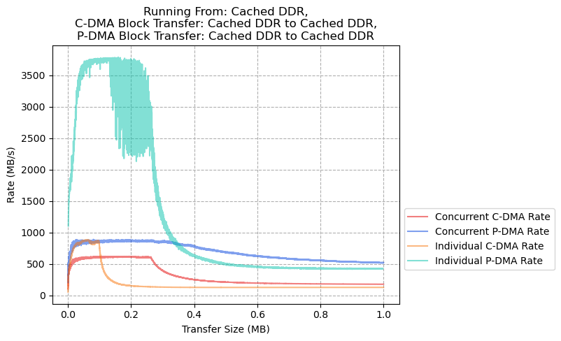

### CoreAXI4 DMA: Cached DDR to Cached DDR, PDMA: Cached DDR to Non-Cached DDR

### CoreAXI4 DMA: Cached DDR to Cached DDR, PDMA: Non-Cached DDR to Cached DDR

### CoreAXI4 DMA: Cached DDR to Cached DDR, PDMA: Non-Cached DDR to Non-Cached DDR

### CoreAXI4 DMA: Cached DDR to Non-Cached DDR, PDMA: Cached DDR to Cached DDR

### CoreAXI4 DMA: Cached DDR to Non-Cached DDR, PDMA: Cached DDR to Non-Cached DDR

### CoreAXI4 DMA: Cached DDR to Non-Cached DDR, PDMA: Non-Cached DDR to Cached DDR

### CoreAXI4 DMA: Cached DDR to Non-Cached DDR, PDMA: Non-Cached DDR to Non-Cached DDR

### CoreAXI4 DMA: Non-Cached DDR to Cached DDR, PDMA: Cached DDR to Cached DDR

### CoreAXI4 DMA: Non-Cached DDR to Cached DDR, PDMA: Non-Cached DDR to Cached DDR

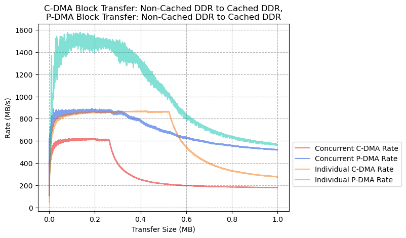

### CoreAXI4 DMA: Non-Cached DDR to Cached DDR, PDMA: Cached DDR to Non-Cached DDR

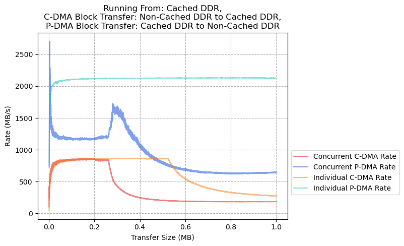

### CoreAXI4 DMA: Non-Cached DDR to Cached DDR, PDMA: Non-Cached DDR to Non-Cached DDR

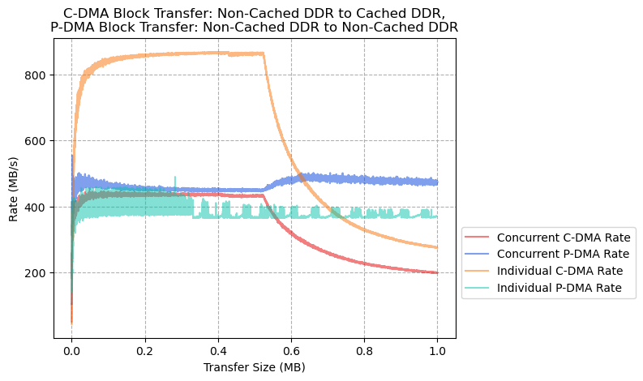

### CoreAXI4 DMA: Non-Cached DDR to Non-Cached DDR, PDMA: Cached DDR to Cached DDR

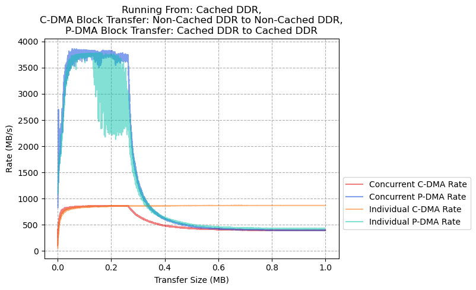

### CoreAXI4 DMA: Non-Cached DDR to Non-Cached DDR, PDMA: Cached DDR to Non-Cached DDR

### CoreAXI4 DMA: Non-Cached DDR to Non-Cached DDR, PDMA: Non-Cached DDR to Cached DDR

### CoreAXI4 DMA: Non-Cached DDR to Non-Cached DDR, PDMA: Non-Cached DDR to Non-Cached DDR

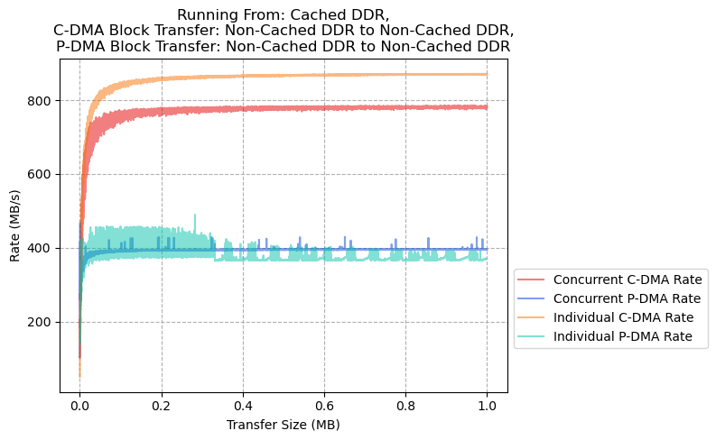

## Results - Stream Transfers, Running from Cached DDR

### CoreAXI4 DMA: Stream Transfer to Cached DDR, PDMA: Cached DDR to Cached DDR

### CoreAXI4 DMA: Stream Transfer to Cached DDR, PDMA: Cached DDR to Non-Cached DDR

### CoreAXI4 DMA: Stream Transfer to Cached DDR, PDMA: Non-Cached DDR to Cached DDR

### CoreAXI4 DMA: Stream Transfer to Cached DDR, PDMA: Non-Cached DDR to Non-Cached DDR

### CoreAXI4 DMA: Stream Transfer to Non-Cached DDR, PDMA: Cached DDR to Cached DDR

### CoreAXI4 DMA: Stream Transfer to Non-Cached DDR, PDMA: Cached DDR to Non-Cached DDR

### CoreAXI4 DMA: Stream Transfer to Non-Cached DDR, PDMA: Non-Cached DDR to Cached DDR

### CoreAXI4 DMA: Stream Transfer to Non-Cached DDR, PDMA: Non-Cached DDR to Non-Cached DDR

## Results - Block Transfers, Running From Scratchpad Memory

### CoreAXI4 DMA: Cached DDR to Cached DDR, PDMA: Cached DDR to Cached DDR

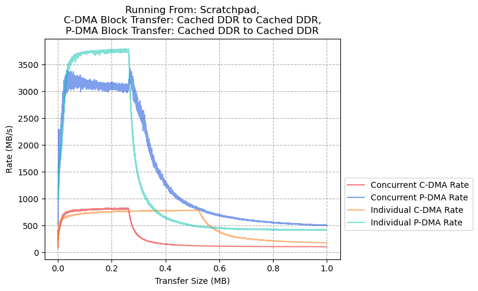

### CoreAXI4 DMA: Cached DDR to Cached DDR, PDMA: Cached DDR to Non-Cached DDR

### CoreAXI4 DMA: Cached DDR to Cached DDR, PDMA: Non-Cached DDR to Cached DDR

### CoreAXI4 DMA: Cached DDR to Cached DDR, PDMA: Non-Cached DDR to Non-Cached DDR

### CoreAXI4 DMA: Cached DDR to Non-Cached DDR, PDMA: Cached DDR to Cached DDR

### CoreAXI4 DMA: Cached DDR to Non-Cached DDR, PDMA: Cached DDR to Non-Cached DDR

### CoreAXI4 DMA: Cached DDR to Non-Cached DDR, PDMA: Non-Cached DDR to Cached DDR

### CoreAXI4 DMA: Cached DDR to Non-Cached DDR, PDMA: Non-Cached DDR to Non-Cached DDR

### CoreAXI4 DMA: Non-Cached DDR to Cached DDR, PDMA: Cached DDR to Cached DDR

### CoreAXI4 DMA: Non-Cached DDR to Cached DDR, PDMA: Non-Cached DDR to Cached DDR

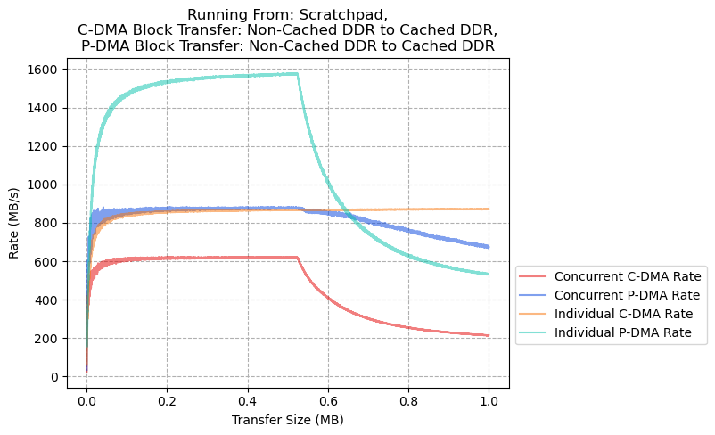

### CoreAXI4 DMA: Non-Cached DDR to Cached DDR, PDMA: Cached DDR to Non-Cached DDR

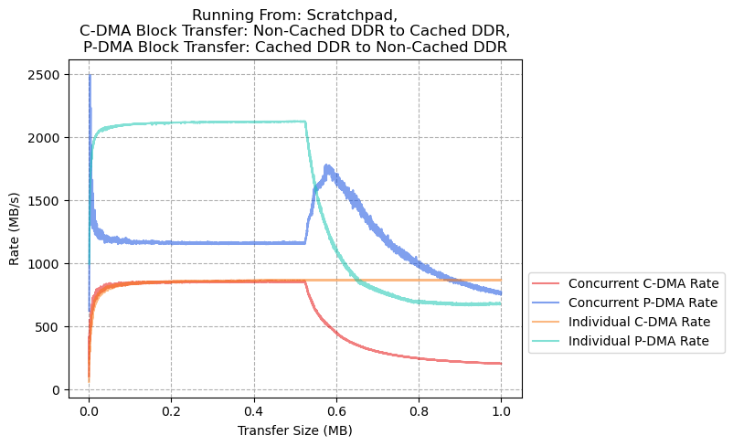

### CoreAXI4 DMA: Non-Cached DDR to Cached DDR, PDMA: Non-Cached DDR to Non-Cached DDR

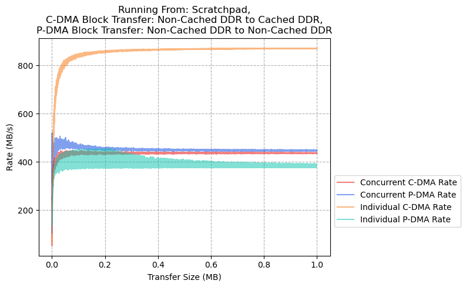

### CoreAXI4 DMA: Non-Cached DDR to Non-Cached DDR, PDMA: Cached DDR to Cached DDR

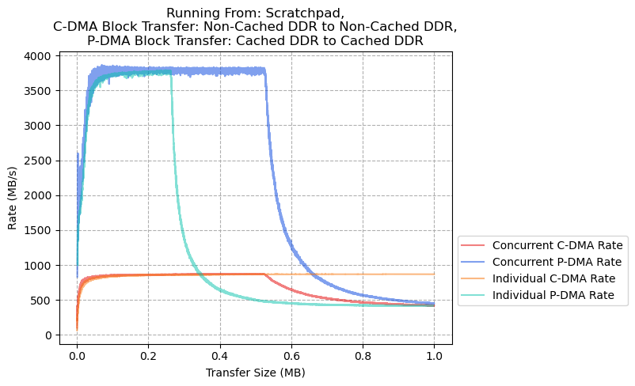

### CoreAXI4 DMA: Non-Cached DDR to Non-Cached DDR, PDMA: Cached DDR to Non-Cached DDR

### CoreAXI4 DMA: Non-Cached DDR to Non-Cached DDR, PDMA: Non-Cached DDR to Cached DDR

### CoreAXI4 DMA: Non-Cached DDR to Non-Cached DDR, PDMA: Non-Cached DDR to Non-Cached DDR

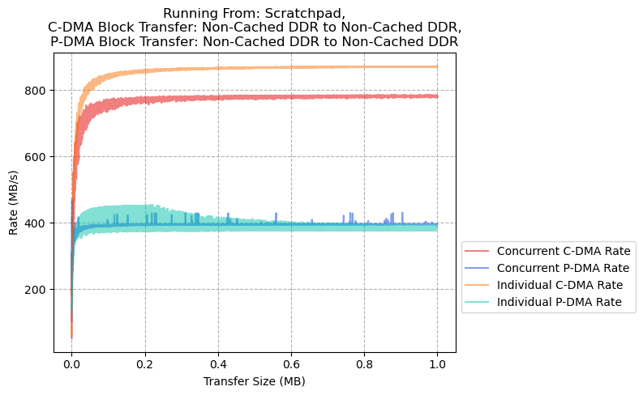

## Results - Stream Transfers, Running from Scratchpad Memory

### CoreAXI4 DMA: Stream Transfer to Cached DDR, PDMA: Cached DDR to Cached DDR

### CoreAXI4 DMA: Stream Transfer to Cached DDR, PDMA: Cached DDR to Non-Cached DDR

### CoreAXI4 DMA: Stream Transfer to Cached DDR, PDMA: Non-Cached DDR to Cached DDR

### CoreAXI4 DMA: Stream Transfer to Cached DDR, PDMA: Non-Cached DDR to Non-Cached DDR

### CoreAXI4 DMA: Stream Transfer to Non-Cached DDR, PDMA: Cached DDR to Cached DDR

### CoreAXI4 DMA: Stream Transfer to Non-Cached DDR, PDMA: Cached DDR to Non-Cached DDR

### CoreAXI4 DMA: Stream Transfer to Non-Cached DDR, PDMA: Non-Cached DDR to Cached DDR

### CoreAXI4 DMA: Stream Transfer to Non-Cached DDR, PDMA: Non-Cached DDR to Non-Cached DDR

## Results - Block Transfers, Running From L2-Lim

### CoreAXI4 DMA: Cached DDR to Cached DDR, PDMA: Cached DDR to Cached DDR

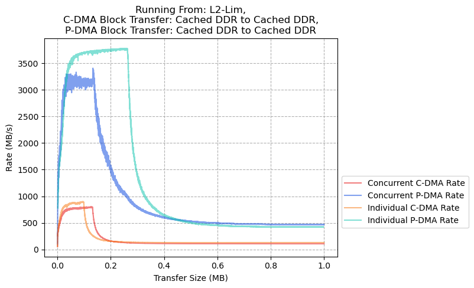

### CoreAXI4 DMA: Cached DDR to Cached DDR, PDMA: Cached DDR to Non-Cached DDR

### CoreAXI4 DMA: Cached DDR to Cached DDR, PDMA: Non-Cached DDR to Cached DDR

### CoreAXI4 DMA: Cached DDR to Cached DDR, PDMA: Non-Cached DDR to Non-Cached DDR

### CoreAXI4 DMA: Cached DDR to Non-Cached DDR, PDMA: Cached DDR to Cached DDR

### CoreAXI4 DMA: Cached DDR to Non-Cached DDR, PDMA: Cached DDR to Non-Cached DDR

### CoreAXI4 DMA: Cached DDR to Non-Cached DDR, PDMA: Non-Cached DDR to Cached DDR

### CoreAXI4 DMA: Cached DDR to Non-Cached DDR, PDMA: Non-Cached DDR to Non-Cached DDR

### CoreAXI4 DMA: Non-Cached DDR to Cached DDR, PDMA: Cached DDR to Cached DDR

### CoreAXI4 DMA: Non-Cached DDR to Cached DDR, PDMA: Non-Cached DDR to Cached DDR

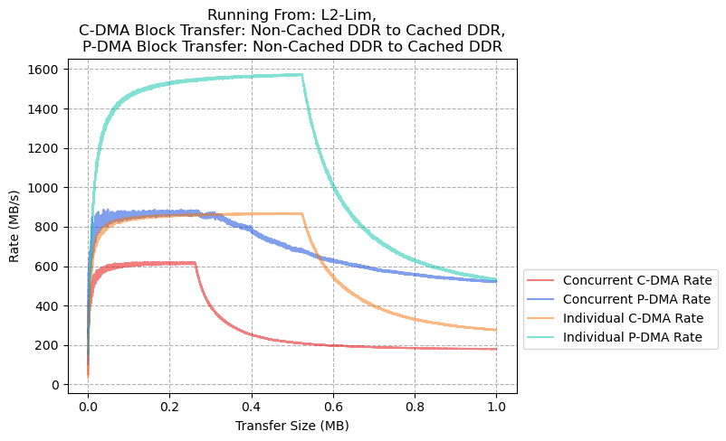

### CoreAXI4 DMA: Non-Cached DDR to Cached DDR, PDMA: Cached DDR to Non-Cached DDR

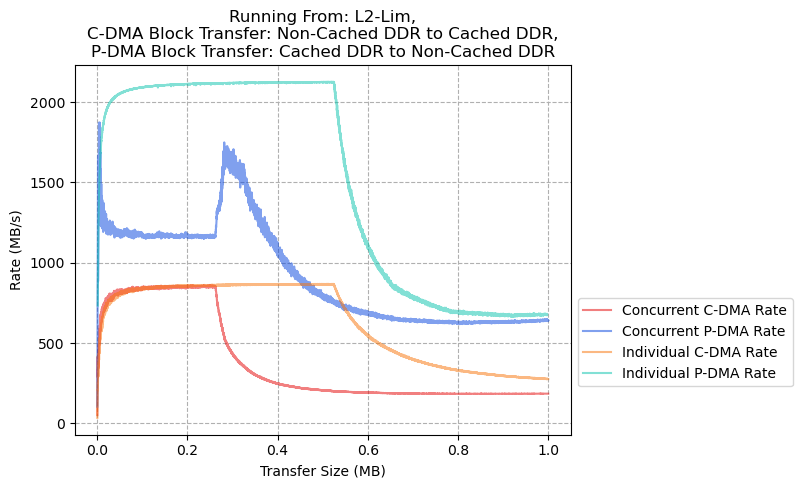

### CoreAXI4 DMA: Non-Cached DDR to Cached DDR, PDMA: Non-Cached DDR to Non-Cached DDR

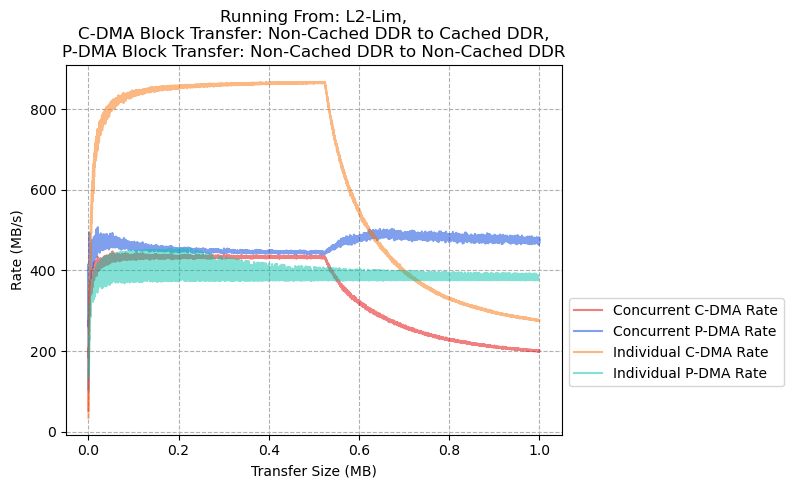

### CoreAXI4 DMA: Non-Cached DDR to Non-Cached DDR, PDMA: Cached DDR to Cached DDR

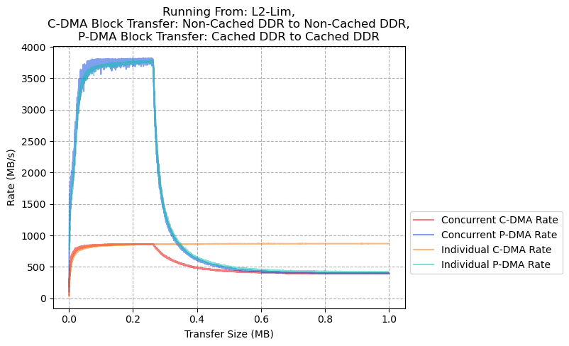

### CoreAXI4 DMA: Non-Cached DDR to Non-Cached DDR, PDMA: Cached DDR to Non-Cached DDR

### CoreAXI4 DMA: Non-Cached DDR to Non-Cached DDR, PDMA: Non-Cached DDR to Cached DDR

### CoreAXI4 DMA: Non-Cached DDR to Non-Cached DDR, PDMA: Non-Cached DDR to Non-Cached DDR

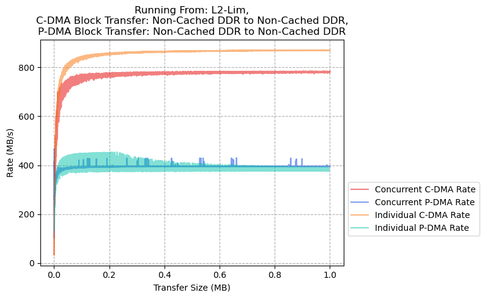

## Results - Stream Transfers, Running from L2-Lim

### CoreAXI4 DMA: Stream Transfer to Cached DDR, PDMA: Cached DDR to Cached DDR

### CoreAXI4 DMA: Stream Transfer to Cached DDR, PDMA: Cached DDR to Non-Cached DDR

### CoreAXI4 DMA: Stream Transfer to Cached DDR, PDMA: Non-Cached DDR to Cached DDR

### CoreAXI4 DMA: Stream Transfer to Cached DDR, PDMA: Non-Cached DDR to Non-Cached DDR

### CoreAXI4 DMA: Stream Transfer to Non-Cached DDR, PDMA: Cached DDR to Cached DDR

### CoreAXI4 DMA: Stream Transfer to Non-Cached DDR, PDMA: Cached DDR to Non-Cached DDR

### CoreAXI4 DMA: Stream Transfer to Non-Cached DDR, PDMA: Non-Cached DDR to Cached DDR

### CoreAXI4 DMA: Stream Transfer to Non-Cached DDR, PDMA: Non-Cached DDR to Non-Cached DDR

