# Concurrent DMA Transfer Benchmarks

- [Concurrent DMA Transfer Benchmarks](#concurrent-dma-transfer-benchmarks)
  - [Running from Cached DDR](#running-from-cached-ddr)
    - [Block Transfers](#block-transfers)
      - [Fabric-DMA: Cached DDR to Cached DDR](#fabric-dma-cached-ddr-to-cached-ddr)
      - [Fabric-DMA: Cached DDR to Non-Cached DDR](#fabric-dma-cached-ddr-to-non-cached-ddr)
      - [Fabric-DMA: Non-Cached DDR to Cached DDR](#fabric-dma-non-cached-ddr-to-cached-ddr)
      - [Fabric-DMA: Non-Cached DDR to Non-Cached DDR](#fabric-dma-non-cached-ddr-to-non-cached-ddr)
    - [Stream Transfers](#stream-transfers)
      - [Fabric-DMA: Stream Transfer to Cached DDR](#fabric-dma-stream-transfer-to-cached-ddr)
      - [Fabric-DMA: Stream Transfer to Non-Cached DDR](#fabric-dma-stream-transfer-to-non-cached-ddr)
  - [Running from Scratchpad Memory](#running-from-scratchpad-memory)
    - [Block Transfers](#block-transfers-1)
      - [Fabric-DMA: Cached DDR to Cached DDR](#fabric-dma-cached-ddr-to-cached-ddr-1)
      - [Fabric-DMA: Cached DDR to Non-Cached DDR](#fabric-dma-cached-ddr-to-non-cached-ddr-1)
      - [Fabric-DMA: Non-Cached DDR to Cached DDR](#fabric-dma-non-cached-ddr-to-cached-ddr-1)
      - [Fabric-DMA: Non-Cached DDR to Non-Cached DDR](#fabric-dma-non-cached-ddr-to-non-cached-ddr-1)
    - [Stream Transfers](#stream-transfers-1)
      - [Fabric-DMA: Stream Transfer to Cached DDR](#fabric-dma-stream-transfer-to-cached-ddr-1)
      - [Fabric-DMA: Stream Transfer to Non-Cached DDR](#fabric-dma-stream-transfer-to-non-cached-ddr-1)
  - [Running from L2-Lim](#running-from-l2-lim)
    - [Block Transfers](#block-transfers-2)
      - [Fabric-DMA: Cached DDR to Cached DDR](#fabric-dma-cached-ddr-to-cached-ddr-2)
      - [Fabric-DMA: Cached DDR to Non-Cached DDR](#fabric-dma-cached-ddr-to-non-cached-ddr-2)
      - [Fabric-DMA: Non-Cached DDR to Cached DDR](#fabric-dma-non-cached-ddr-to-cached-ddr-2)
      - [Fabric-DMA: Non-Cached DDR to Non-Cached DDR](#fabric-dma-non-cached-ddr-to-non-cached-ddr-2)
    - [Stream Transfers](#stream-transfers-2)
      - [Fabric-DMA: Stream Transfer to Cached DDR](#fabric-dma-stream-transfer-to-cached-ddr-2)
      - [Fabric-DMA: Stream Transfer to Non-Cached DDR](#fabric-dma-stream-transfer-to-non-cached-ddr-2)

## Running from Cached DDR

### Block Transfers

#### Fabric-DMA: Cached DDR to Cached DDR

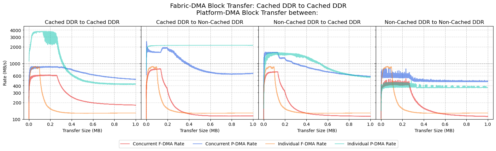

#### Fabric-DMA: Cached DDR to Non-Cached DDR

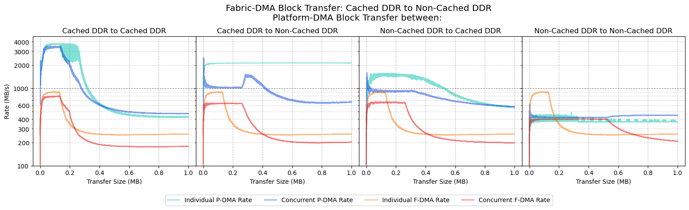

#### Fabric-DMA: Non-Cached DDR to Cached DDR

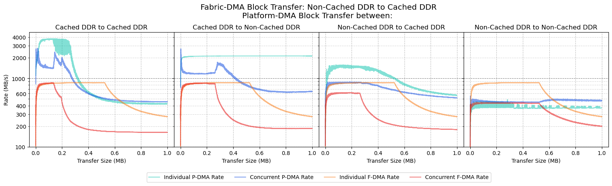

#### Fabric-DMA: Non-Cached DDR to Non-Cached DDR

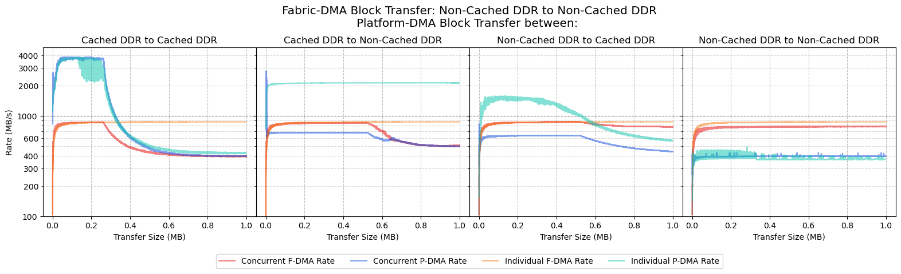

### Stream Transfers

#### Fabric-DMA: Stream Transfer to Cached DDR

#### Fabric-DMA: Stream Transfer to Non-Cached DDR

## Running from Scratchpad Memory

### Block Transfers

#### Fabric-DMA: Cached DDR to Cached DDR

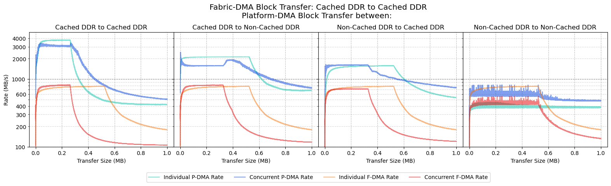

#### Fabric-DMA: Cached DDR to Non-Cached DDR

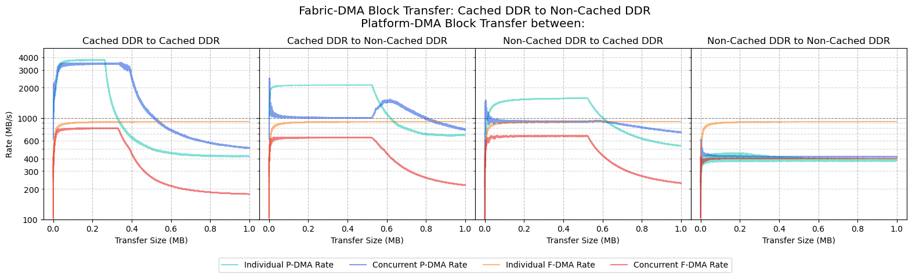

#### Fabric-DMA: Non-Cached DDR to Cached DDR

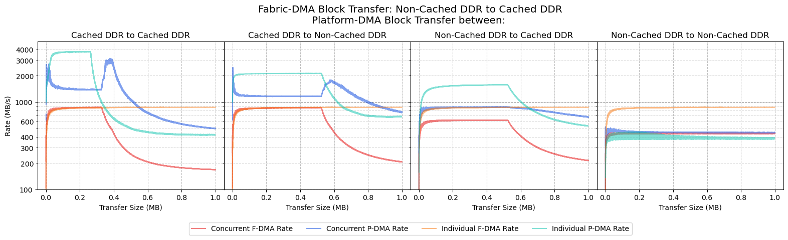

#### Fabric-DMA: Non-Cached DDR to Non-Cached DDR

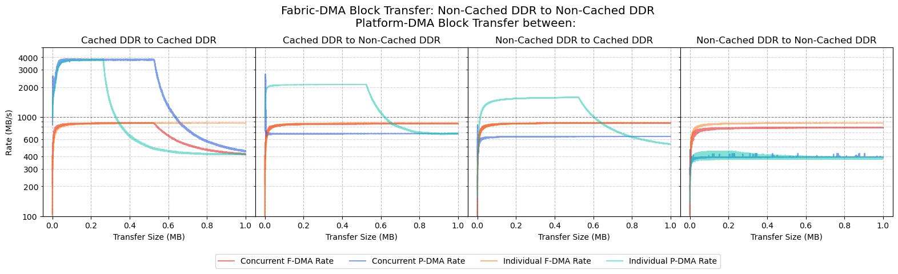

### Stream Transfers

The following set of results show the performance of the Platform-DMA (P-DMA) block transferring data,
while the CoreAXI4DMA (Fabric-DMA/F-DMA) is concurrently stream transferring data.

#### Fabric-DMA: Stream Transfer to Cached DDR

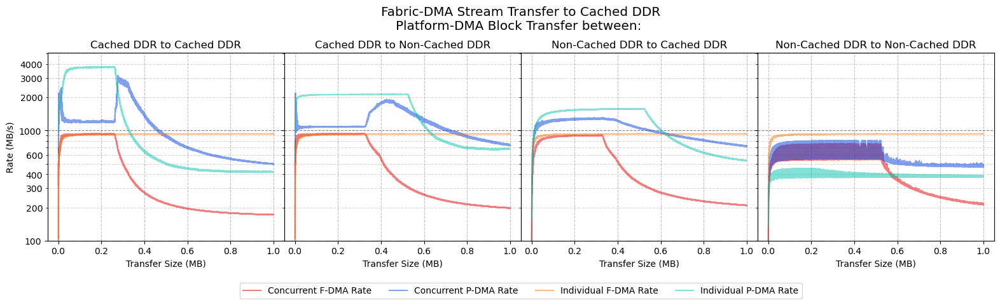

#### Fabric-DMA: Stream Transfer to Non-Cached DDR

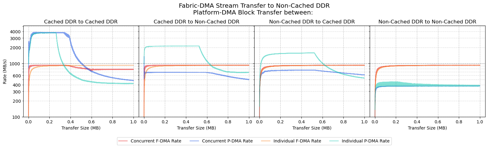

## Running from L2-Lim

### Block Transfers

#### Fabric-DMA: Cached DDR to Cached DDR

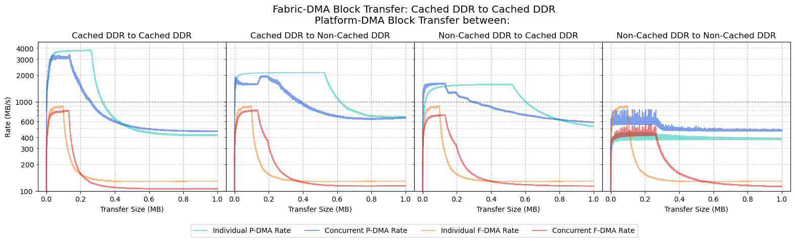

#### Fabric-DMA: Cached DDR to Non-Cached DDR

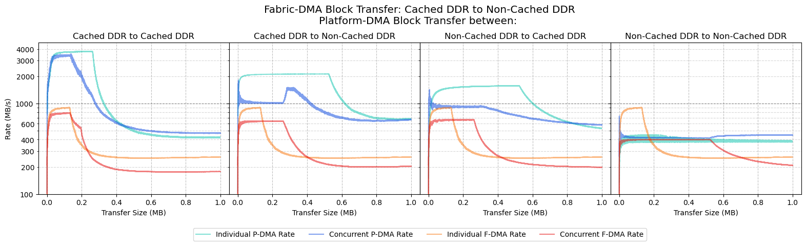

#### Fabric-DMA: Non-Cached DDR to Cached DDR

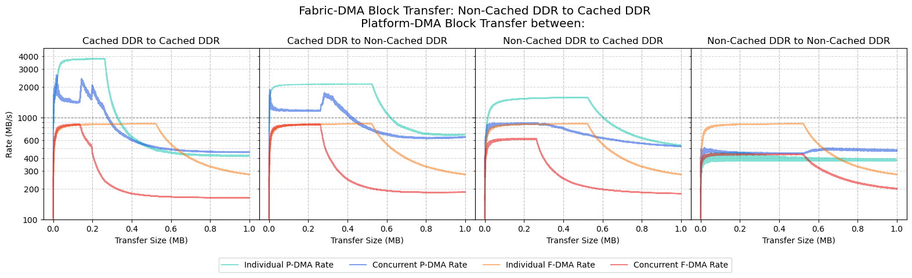

#### Fabric-DMA: Non-Cached DDR to Non-Cached DDR

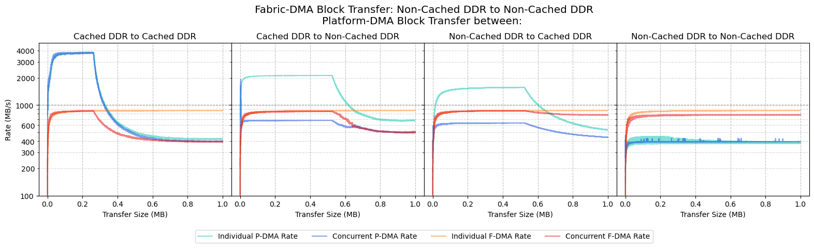

### Stream Transfers

#### Fabric-DMA: Stream Transfer to Cached DDR

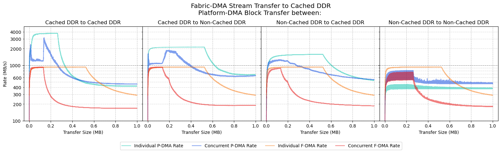

#### Fabric-DMA: Stream Transfer to Non-Cached DDR

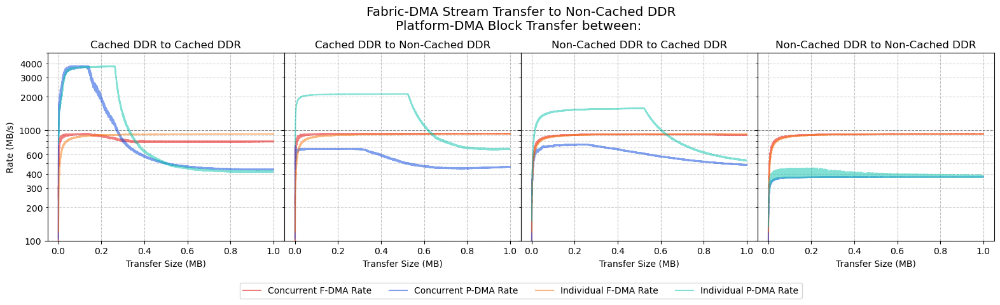
