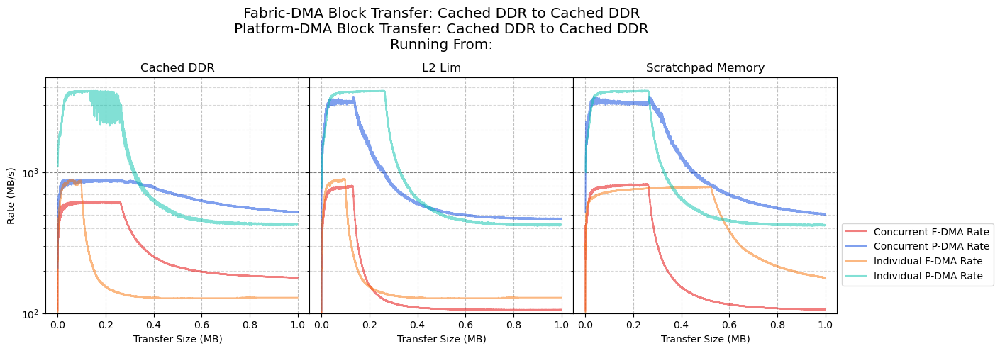
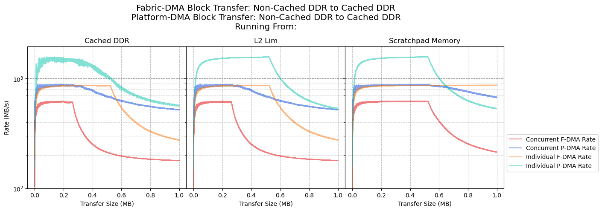
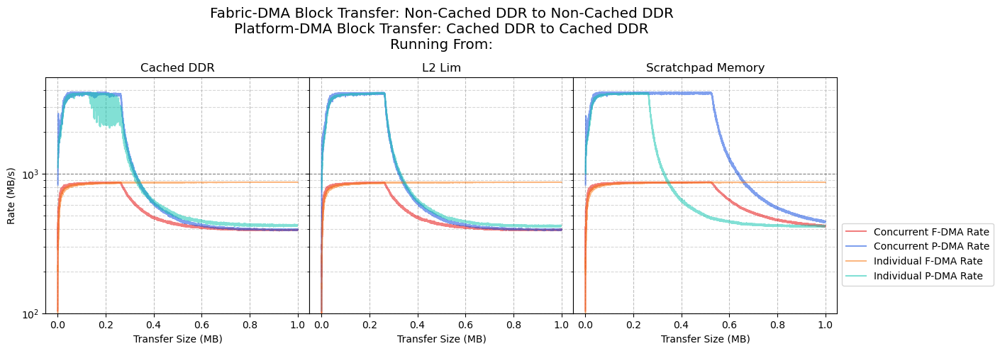

# Concurrent DMA Transfer Benchmarks

- [Concurrent DMA Transfer Benchmarks](#concurrent-dma-transfer-benchmarks)
  - [Results - Block Transfers](#results---block-transfers)
    - [Fabric-DMA: Cached DDR to Cached DDR, Platform-DMA: Cached DDR to Cached DDR](#fabric-dma-cached-ddr-to-cached-ddr-platform-dma-cached-ddr-to-cached-ddr)
    - [Fabric-DMA: Cached DDR to Cached DDR, Platform-DMA: Cached DDR to Non-Cached DDR](#fabric-dma-cached-ddr-to-cached-ddr-platform-dma-cached-ddr-to-non-cached-ddr)
    - [Fabric-DMA: Cached DDR to Cached DDR, Platform-DMA: Non-Cached DDR to Cached DDR](#fabric-dma-cached-ddr-to-cached-ddr-platform-dma-non-cached-ddr-to-cached-ddr)
    - [Fabric-DMA: Cached DDR to Cached DDR, Platform-DMA: Non-Cached DDR to Non-Cached DDR](#fabric-dma-cached-ddr-to-cached-ddr-platform-dma-non-cached-ddr-to-non-cached-ddr)
    - [Fabric-DMA: Cached DDR to Non-Cached DDR, Platform-DMA: Cached DDR to Cached DDR](#fabric-dma-cached-ddr-to-non-cached-ddr-platform-dma-cached-ddr-to-cached-ddr)
    - [Fabric-DMA: Cached DDR to Non-Cached DDR, Platform-DMA: Cached DDR to Non-Cached DDR](#fabric-dma-cached-ddr-to-non-cached-ddr-platform-dma-cached-ddr-to-non-cached-ddr)
    - [Fabric-DMA: Cached DDR to Non-Cached DDR, Platform-DMA: Non-Cached DDR to Cached DDR](#fabric-dma-cached-ddr-to-non-cached-ddr-platform-dma-non-cached-ddr-to-cached-ddr)
    - [Fabric-DMA: Cached DDR to Non-Cached DDR, Platform-DMA: Non-Cached DDR to Non-Cached DDR](#fabric-dma-cached-ddr-to-non-cached-ddr-platform-dma-non-cached-ddr-to-non-cached-ddr)
    - [Fabric-DMA: Non-Cached DDR to Cached DDR, Platform-DMA: Cached DDR to Cached DDR](#fabric-dma-non-cached-ddr-to-cached-ddr-platform-dma-cached-ddr-to-cached-ddr)
    - [Fabric-DMA: Non-Cached DDR to Cached DDR, Platform-DMA: Non-Cached DDR to Cached DDR](#fabric-dma-non-cached-ddr-to-cached-ddr-platform-dma-non-cached-ddr-to-cached-ddr)
    - [Fabric-DMA: Non-Cached DDR to Cached DDR, Platform-DMA: Cached DDR to Non-Cached DDR](#fabric-dma-non-cached-ddr-to-cached-ddr-platform-dma-cached-ddr-to-non-cached-ddr)
    - [Fabric-DMA: Non-Cached DDR to Cached DDR, Platform-DMA: Non-Cached DDR to Non-Cached DDR](#fabric-dma-non-cached-ddr-to-cached-ddr-platform-dma-non-cached-ddr-to-non-cached-ddr)
    - [Fabric-DMA: Non-Cached DDR to Non-Cached DDR, Platform-DMA: Cached DDR to Cached DDR](#fabric-dma-non-cached-ddr-to-non-cached-ddr-platform-dma-cached-ddr-to-cached-ddr)
    - [Fabric-DMA: Non-Cached DDR to Non-Cached DDR, Platform-DMA: Cached DDR to Non-Cached DDR](#fabric-dma-non-cached-ddr-to-non-cached-ddr-platform-dma-cached-ddr-to-non-cached-ddr)
    - [Fabric-DMA: Non-Cached DDR to Non-Cached DDR, Platform-DMA: Non-Cached DDR to Cached DDR](#fabric-dma-non-cached-ddr-to-non-cached-ddr-platform-dma-non-cached-ddr-to-cached-ddr)
    - [Fabric-DMA: Non-Cached DDR to Non-Cached DDR, Platform-DMA: Non-Cached DDR to Non-Cached DDR](#fabric-dma-non-cached-ddr-to-non-cached-ddr-platform-dma-non-cached-ddr-to-non-cached-ddr)
  - [Results - Stream Transfers](#results---stream-transfers)
    - [Fabric-DMA: Stream Transfer to Cached DDR, Platform-DMA: Cached DDR to Cached DDR](#fabric-dma-stream-transfer-to-cached-ddr-platform-dma-cached-ddr-to-cached-ddr)
    - [Fabric-DMA: Stream Transfer to Cached DDR, Platform-DMA: Cached DDR to Non-Cached DDR](#fabric-dma-stream-transfer-to-cached-ddr-platform-dma-cached-ddr-to-non-cached-ddr)
    - [Fabric-DMA: Stream Transfer to Cached DDR, Platform-DMA: Non-Cached DDR to Cached DDR](#fabric-dma-stream-transfer-to-cached-ddr-platform-dma-non-cached-ddr-to-cached-ddr)
    - [Fabric-DMA: Stream Transfer to Cached DDR, Platform-DMA: Non-Cached DDR to Non-Cached DDR](#fabric-dma-stream-transfer-to-cached-ddr-platform-dma-non-cached-ddr-to-non-cached-ddr)
    - [Fabric-DMA: Stream Transfer to Non-Cached DDR, Platform-DMA: Cached DDR to Cached DDR](#fabric-dma-stream-transfer-to-non-cached-ddr-platform-dma-cached-ddr-to-cached-ddr)
    - [Fabric-DMA: Stream Transfer to Non-Cached DDR, Platform-DMA: Cached DDR to Non-Cached DDR](#fabric-dma-stream-transfer-to-non-cached-ddr-platform-dma-cached-ddr-to-non-cached-ddr)
    - [Fabric-DMA: Stream Transfer to Non-Cached DDR, Platform-DMA: Non-Cached DDR to Cached DDR](#fabric-dma-stream-transfer-to-non-cached-ddr-platform-dma-non-cached-ddr-to-cached-ddr)
    - [Fabric-DMA: Stream Transfer to Non-Cached DDR, Platform-DMA: Non-Cached DDR to Non-Cached DDR](#fabric-dma-stream-transfer-to-non-cached-ddr-platform-dma-non-cached-ddr-to-non-cached-ddr)

## Results - Block Transfers

The following set of results show the performance of the Platform-DMA (P-DMA) block transferring data,
while the CoreAXI4DMA (Fabric-DMA/F-DMA) is also concurrently block transferring data.

### Fabric-DMA: Cached DDR to Cached DDR, Platform-DMA: Cached DDR to Cached DDR

### Fabric-DMA: Cached DDR to Cached DDR, Platform-DMA: Cached DDR to Non-Cached DDR

### Fabric-DMA: Cached DDR to Cached DDR, Platform-DMA: Non-Cached DDR to Cached DDR

### Fabric-DMA: Cached DDR to Cached DDR, Platform-DMA: Non-Cached DDR to Non-Cached DDR

### Fabric-DMA: Cached DDR to Non-Cached DDR, Platform-DMA: Cached DDR to Cached DDR

### Fabric-DMA: Cached DDR to Non-Cached DDR, Platform-DMA: Cached DDR to Non-Cached DDR

### Fabric-DMA: Cached DDR to Non-Cached DDR, Platform-DMA: Non-Cached DDR to Cached DDR

### Fabric-DMA: Cached DDR to Non-Cached DDR, Platform-DMA: Non-Cached DDR to Non-Cached DDR

### Fabric-DMA: Non-Cached DDR to Cached DDR, Platform-DMA: Cached DDR to Cached DDR

### Fabric-DMA: Non-Cached DDR to Cached DDR, Platform-DMA: Non-Cached DDR to Cached DDR

### Fabric-DMA: Non-Cached DDR to Cached DDR, Platform-DMA: Cached DDR to Non-Cached DDR

### Fabric-DMA: Non-Cached DDR to Cached DDR, Platform-DMA: Non-Cached DDR to Non-Cached DDR

### Fabric-DMA: Non-Cached DDR to Non-Cached DDR, Platform-DMA: Cached DDR to Cached DDR

### Fabric-DMA: Non-Cached DDR to Non-Cached DDR, Platform-DMA: Cached DDR to Non-Cached DDR

### Fabric-DMA: Non-Cached DDR to Non-Cached DDR, Platform-DMA: Non-Cached DDR to Cached DDR

### Fabric-DMA: Non-Cached DDR to Non-Cached DDR, Platform-DMA: Non-Cached DDR to Non-Cached DDR

## Results - Stream Transfers

The following set of results show the performance of the Platform-DMA (P-DMA) block transferring data,
while the CoreAXI4DMA (Fabric-DMA/F-DMA) is concurrently stream transferring data.

### Fabric-DMA: Stream Transfer to Cached DDR, Platform-DMA: Cached DDR to Cached DDR

### Fabric-DMA: Stream Transfer to Cached DDR, Platform-DMA: Cached DDR to Non-Cached DDR

### Fabric-DMA: Stream Transfer to Cached DDR, Platform-DMA: Non-Cached DDR to Cached DDR

### Fabric-DMA: Stream Transfer to Cached DDR, Platform-DMA: Non-Cached DDR to Non-Cached DDR

### Fabric-DMA: Stream Transfer to Non-Cached DDR, Platform-DMA: Cached DDR to Cached DDR

### Fabric-DMA: Stream Transfer to Non-Cached DDR, Platform-DMA: Cached DDR to Non-Cached DDR

### Fabric-DMA: Stream Transfer to Non-Cached DDR, Platform-DMA: Non-Cached DDR to Cached DDR

### Fabric-DMA: Stream Transfer to Non-Cached DDR, Platform-DMA: Non-Cached DDR to Non-Cached DDR

