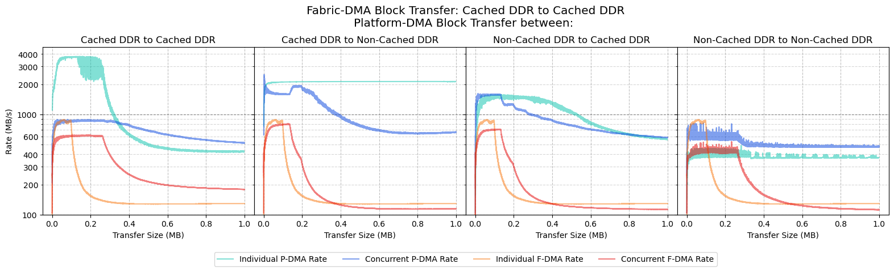
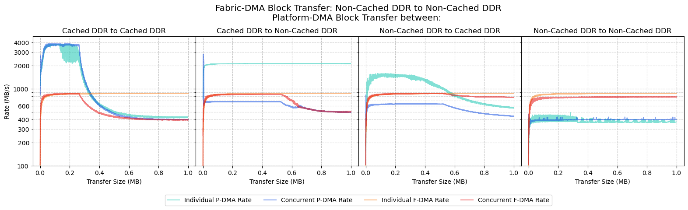
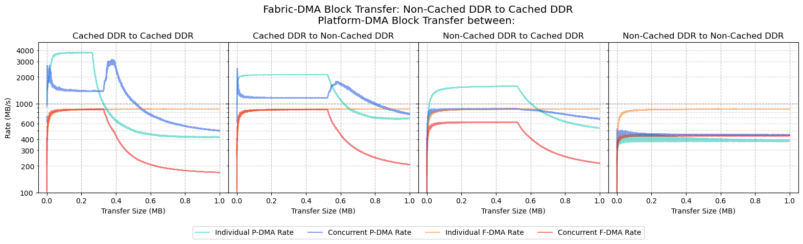
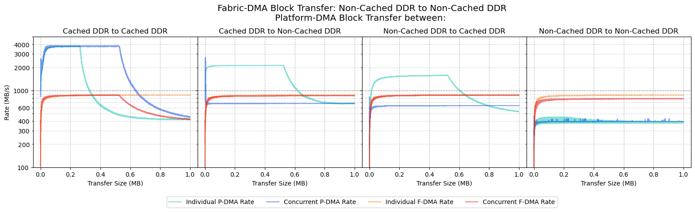
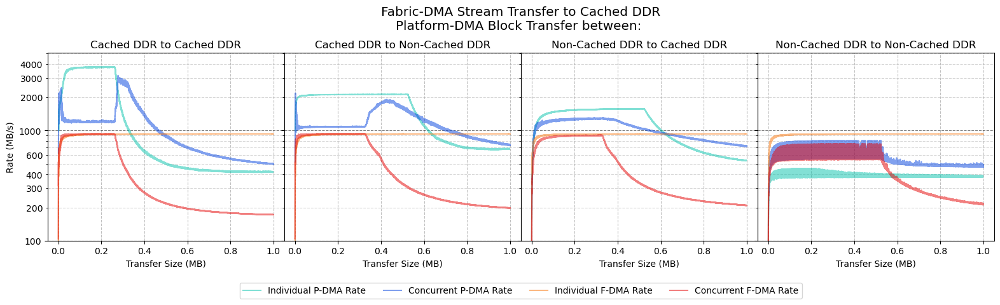
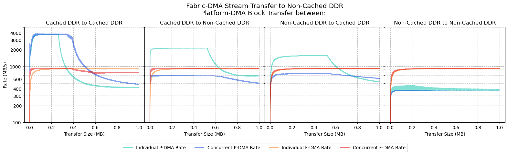
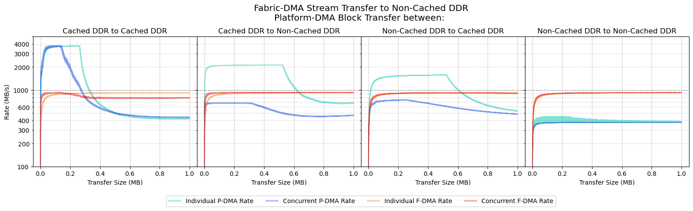

# Concurrent DMA Transfer Benchmarks

- [Concurrent DMA Transfer Benchmarks](#concurrent-dma-transfer-benchmarks)
  - [Block Transfers running from Cached DDR](#block-transfers-running-from-cached-ddr)
    - [Fabric-DMA: Cached DDR to Cached DDR](#fabric-dma-cached-ddr-to-cached-ddr)
    - [Fabric-DMA: Cached DDR to Non-Cached DDR](#fabric-dma-cached-ddr-to-non-cached-ddr)
    - [Fabric-DMA: Non-Cached DDR to Cached DDR](#fabric-dma-non-cached-ddr-to-cached-ddr)
    - [Fabric-DMA: Non-Cached DDR to Non-Cached DDR](#fabric-dma-non-cached-ddr-to-non-cached-ddr)
  - [Stream Transfers  running from Cached DDR](#stream-transfers--running-from-cached-ddr)
    - [Fabric-DMA: Stream Transfer to Cached DDR](#fabric-dma-stream-transfer-to-cached-ddr)
    - [Fabric-DMA: Stream Transfer to Non-Cached DDR](#fabric-dma-stream-transfer-to-non-cached-ddr)
  - [Block Transfers running from Scratchpad Memory](#block-transfers-running-from-scratchpad-memory)
    - [Fabric-DMA: Cached DDR to Cached DDR](#fabric-dma-cached-ddr-to-cached-ddr-1)
    - [Fabric-DMA: Cached DDR to Non-Cached DDR](#fabric-dma-cached-ddr-to-non-cached-ddr-1)
    - [Fabric-DMA: Non-Cached DDR to Cached DDR](#fabric-dma-non-cached-ddr-to-cached-ddr-1)
    - [Fabric-DMA: Non-Cached DDR to Non-Cached DDR](#fabric-dma-non-cached-ddr-to-non-cached-ddr-1)
  - [Stream Transfers  running from Scratchpad Memory](#stream-transfers--running-from-scratchpad-memory)
    - [Fabric-DMA: Stream Transfer to Cached DDR](#fabric-dma-stream-transfer-to-cached-ddr-1)
    - [Fabric-DMA: Stream Transfer to Non-Cached DDR](#fabric-dma-stream-transfer-to-non-cached-ddr-1)
  - [Block Transfers running from L2-Lim](#block-transfers-running-from-l2-lim)
    - [Fabric-DMA: Cached DDR to Cached DDR](#fabric-dma-cached-ddr-to-cached-ddr-2)
    - [Fabric-DMA: Cached DDR to Non-Cached DDR](#fabric-dma-cached-ddr-to-non-cached-ddr-2)
    - [Fabric-DMA: Non-Cached DDR to Cached DDR](#fabric-dma-non-cached-ddr-to-cached-ddr-2)
    - [Fabric-DMA: Non-Cached DDR to Non-Cached DDR](#fabric-dma-non-cached-ddr-to-non-cached-ddr-2)
  - [Stream Transfers  running from L2-Lim](#stream-transfers--running-from-l2-lim)
    - [Fabric-DMA: Stream Transfer to Cached DDR](#fabric-dma-stream-transfer-to-cached-ddr-2)
    - [Fabric-DMA: Stream Transfer to Non-Cached DDR](#fabric-dma-stream-transfer-to-non-cached-ddr-2)

## Block Transfers running from Cached DDR

The following set of results show the performance of the Platform-DMA (P-DMA) block transferring data,
while the CoreAXI4DMA (Fabric-DMA/F-DMA) is also concurrently block transferring data.

### Fabric-DMA: Cached DDR to Cached DDR

### Fabric-DMA: Cached DDR to Non-Cached DDR

### Fabric-DMA: Non-Cached DDR to Cached DDR

### Fabric-DMA: Non-Cached DDR to Non-Cached DDR

## Stream Transfers  running from Cached DDR

The following set of results show the performance of the Platform-DMA (P-DMA) block transferring data,
while the CoreAXI4DMA (Fabric-DMA/F-DMA) is concurrently stream transferring data.

### Fabric-DMA: Stream Transfer to Cached DDR

### Fabric-DMA: Stream Transfer to Non-Cached DDR

## Block Transfers running from Scratchpad Memory

The following set of results show the performance of the Platform-DMA (P-DMA) block transferring data,
while the CoreAXI4DMA (Fabric-DMA/F-DMA) is also concurrently block transferring data.

### Fabric-DMA: Cached DDR to Cached DDR

### Fabric-DMA: Cached DDR to Non-Cached DDR

### Fabric-DMA: Non-Cached DDR to Cached DDR

### Fabric-DMA: Non-Cached DDR to Non-Cached DDR

## Stream Transfers  running from Scratchpad Memory

The following set of results show the performance of the Platform-DMA (P-DMA) block transferring data,
while the CoreAXI4DMA (Fabric-DMA/F-DMA) is concurrently stream transferring data.

### Fabric-DMA: Stream Transfer to Cached DDR

### Fabric-DMA: Stream Transfer to Non-Cached DDR

## Block Transfers running from L2-Lim

The following set of results show the performance of the Platform-DMA (P-DMA) block transferring data,
while the CoreAXI4DMA (Fabric-DMA/F-DMA) is also concurrently block transferring data.

### Fabric-DMA: Cached DDR to Cached DDR

### Fabric-DMA: Cached DDR to Non-Cached DDR

### Fabric-DMA: Non-Cached DDR to Cached DDR

### Fabric-DMA: Non-Cached DDR to Non-Cached DDR

## Stream Transfers  running from L2-Lim

The following set of results show the performance of the Platform-DMA (P-DMA) block transferring data,
while the CoreAXI4DMA (Fabric-DMA/F-DMA) is concurrently stream transferring data.

### Fabric-DMA: Stream Transfer to Cached DDR

### Fabric-DMA: Stream Transfer to Non-Cached DDR

